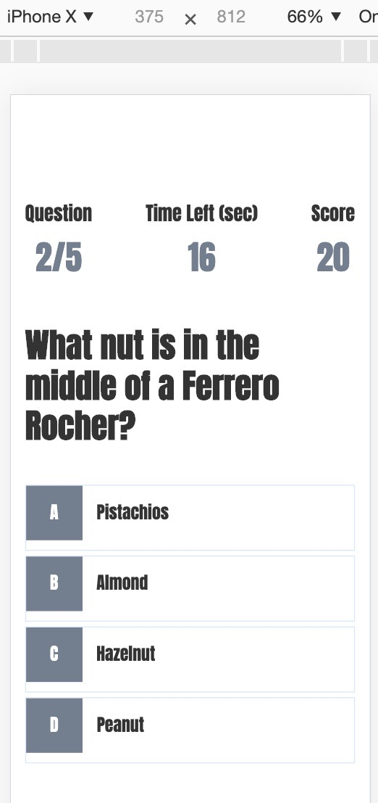

# Random Quiz!

*Created an application using HTML, CSS, Bootstrap and JavaScript code to generate a quiz with a time limit of 2 minutes for user to answer a series of random questions. This app will run in the browser and feature a clean, polished, responsive user interface. Ensuring that it adapts to multiple screen sizes.

*Quiz application has two buttons on the home screen; start and highscores. Click the start button to begin quiz and click highscores button to view the highest achieved.

*User will score 25 points for each correct answer and 0 points for each incorrect answer. Correct answers will be highlighted green and incorrect highlighted green.

*At the end of the quiz the user will have the options of saving thier score by typing thier name in the username box above the save button

*The quiz application is fully funtionally, viewable, and compatible on desktop and mobile screen.

*Application Link: https://mansa-md.github.io/Quiz/

*Quiz - Desktop Responsive Image: 

*Quiz - Mobile Responsive Image:

*

*Quiz - Correct Answer Indicator:

*

*Quiz - Wrong Answer Indicator:

*

